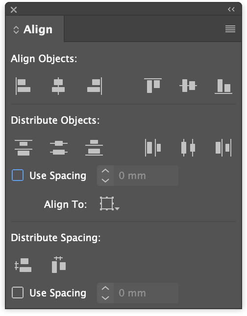

---
hide:
 - navigation
tags:
 - ebookproduction
 - indesign
 - multimedia
---

## Enhancing the fixed layout eBook
>Note: Apple have a document which [covers a lot of this here](https://help.apple.com/itc/booksassetguide).

[Enhancing an eBook with interactivity multimedia and animation](../../eBookProduction/Enhancing%20an%20eBook%20with%20interactivity%20multimedia%20and%20animation.md)

## Audio
- ambient
- music
- effects
- narration

Music will only play on the page where invoked unless special additions are made for Apple Books. In other words, music stops on leaving the page.

### Controlling the audio
Default audio controller can be used and if made wide, then it will be comprehensive with volume control as well.

Buttons are a good option if you want to simply provide a start and stop (actually pause) button.

Look for player buttons on Google - images.

### Ambient sound
By default, audio will stop when the page is changed, however, for Apple Books it is possible to use special code to get the sound to continue playing. _This does involve editing the HTML inside the ePub package_

[Ambient Sound in a Fixed-Layout ePub](../../eBookProduction/Ambient%20Sound%20in%20a%20Fixed-Layout%20ePub.md)

## Video
Video in the form of _mp4_ can be added to a page. You can use the default controller and this may look different on different reading systems.

### Getting Video

Video needs to be hard wired; that is you can't include a link or an iframe from YouTube. You will need to convert from YouTube to an __mp4__ file. 

You cannot always find video to grab (or rip) because it may have the sharing disabled or it may be protected in some way. But you can try.

Here is a useful tool for mac users:

[ViDL for MAC](https://omz-software.com/vidl/)

You can install this for yourself on the MAC in your user application folder.

> [!caution] 
> This doesn't seem to work at the moment 

[https://ytb.rip/3/](https://ytb.rip/3/)

[https://tuberipper.com](https://tuberipper.com)

You can edit the video with the tools on the MAC - iMovie or Premiere.

## Slide Show

You can make a slide show from a _multi-state_ object.

### Image sequences / slide show
We need to first create a range of images (preferably the same size), then an empty frame that will have a fitting setting that will fit proportionally. Then  duplicate the number of times needed. Then place multiple objects...

We can create a _multi-state object_ and then cycle through the images using an overlaid button.

### You need
A number of images all in the same orientation (and the same size if possible)

Watch this screen recording:

## Package the InDesign files

As well as the ePub file, we need the package from InDesign.

> [!check] 
> Make sure there are no missing files before you do this. 

Can't remember how to do this? Here is a quick run through:

