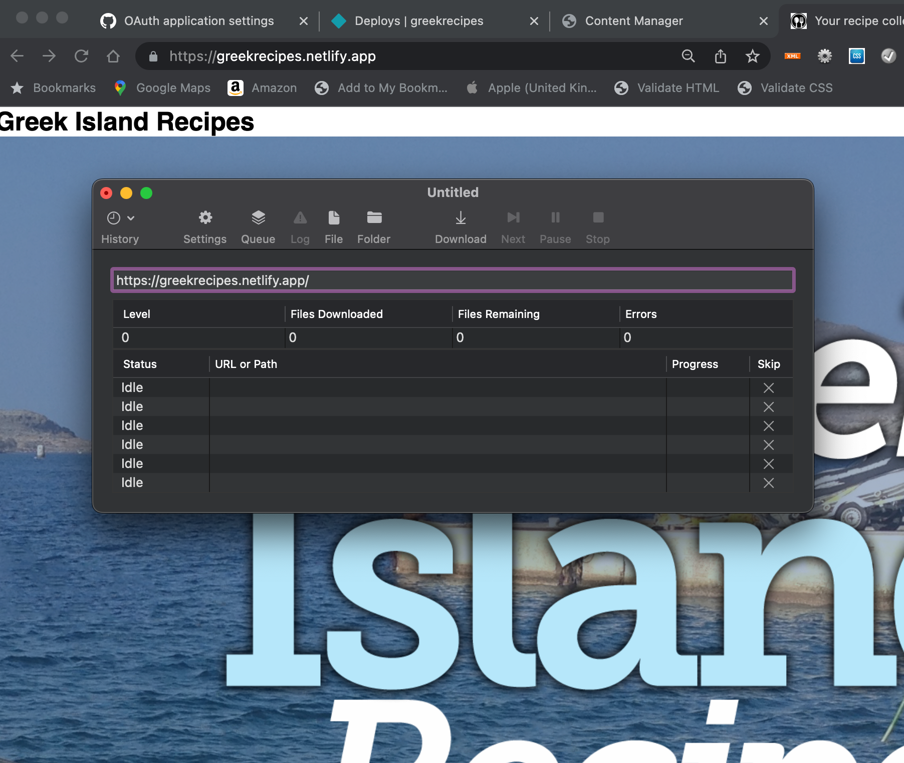

## From the CMS to web
### the process

with all (or most) of the content edited in the CMS:

use *sitesucker* to download the complete live web site to your computer (or google drive project space)

- Open the folder in vscode 
- edit the CSS (not the HTML)
- review the site offline and when happy

- paste ONLY the CSS back to the GitHub repository

You can also edit the `_config.yaml`  file and change the menu to be true. This will produce a menu of of all recipes on each recipe page for easy navigation between recipes.

After styling this _could_ look like this:

>You will notice some other settings; making the `edit` true will place a button on the footer, so that you can easily find the editor.

>There is also a `search` button available there too.

## Some useful info about CSS
What are these units? `px(pixels)``, `em`, `rem`
?
Here is an article I have put together:

[Measure me in Units](../../Articles/Measure%20me%20in%20Units.md)

## Styling the menu 

Here is a codepen site that you can play with and _borrow_ the CSS:

<iframe height="300" style="width: 100%;" scrolling="no" title="Recipe Page" src="https://codepen.io/pageboy/embed/zYowepE?default-tab=html%2Cresult" frameborder="no" loading="lazy" allowtransparency="true" allowfullscreen="true">
  See the Pen <a href="https://codepen.io/pageboy/pen/zYowepE">
  Recipe Page</a> by Chris Jennings (<a href="https://codepen.io/pageboy">@pageboy</a>)
  on <a href="https://codepen.io">CodePen</a>.
</iframe>