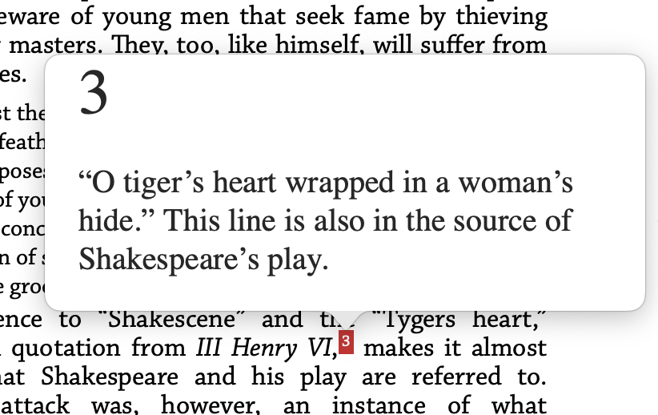
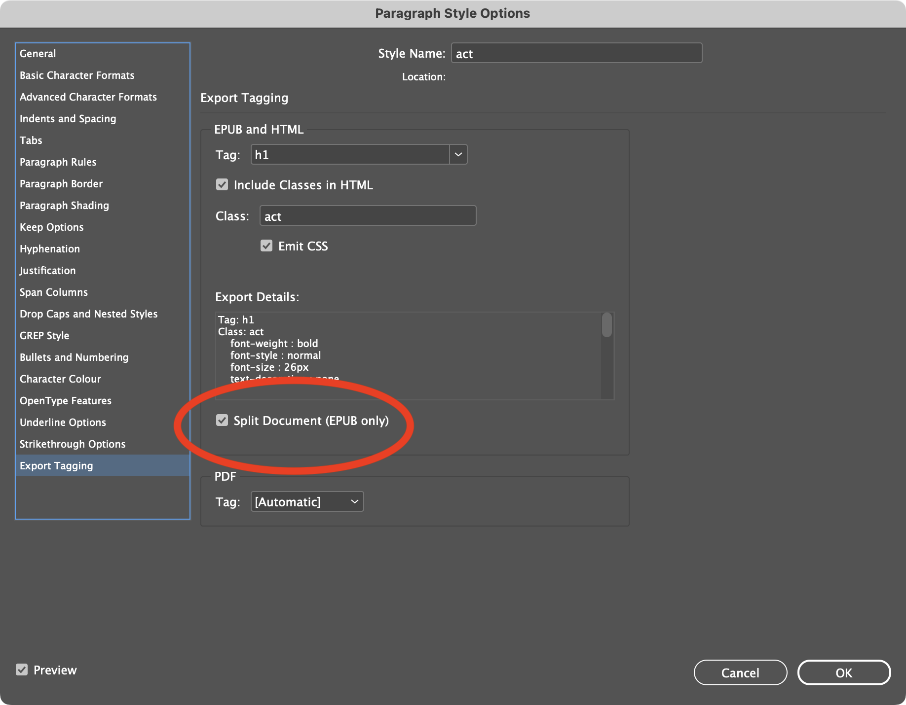
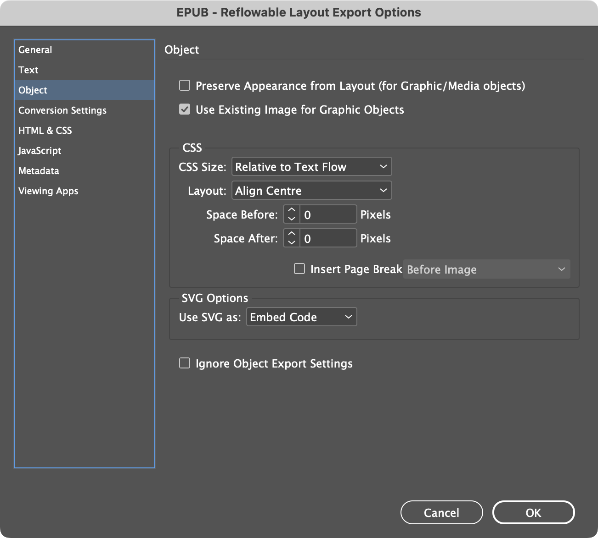

---
hide:
 - navigation
tags:
 - ebookproduction
 - indesign
 - css
---

Any issues for general airing?

>Some reminders for the re-flowable eBook

## Footnotes
I have a very comprehensive [document about footnotes here](https://www.publisha.org/pages/footnotes/).

Make sure to choose Popup Notes when exporting but also try to make the references more visible by changing the CSS for those tags.

First make sure that you have export tagging for the reference in the InDesign document.

![[Screenshot 2022-03-15 at 10.40.22 1.png]]

Then adjust in the CSS

```css
span.reference {
	color:white;
	font-variant:normal;
	text-transform:none;
	vertical-align:super;
	background-color:#d2232a;
	padding:2px;
	font-size:.5em; /*this may not be needed*/
}
```

Putting this in your own CSS will result in this:


>Help! I didn't create a special style for the reference in the text

In this case, you will need to locate one of the references in the HTML of an exported ePub and you may find a class name like this:
`_idFootnoteLink`

Use this in your CSS:

```css
._idFootnoteLink {
	color:white;
	font-variant:normal;
	text-transform:none;
	vertical-align:super;
	background-color:#d2232a;
	padding:2px;
}
```

## Page Breaks
There are different settings that can impact on when a page breaks in the ebook.

### Splitting the ePub
In the `export tagging` settings in InDesign there is an option to split the ePub at this specific style (usually a chapter or section heading). In having this setting, InDesign will create a new HTML document in the ePub package. _This will guarantee that this heading will start on a new page_.



### Keep Options
If the style includes a setting (`keep options`) to start on a new page, then the CSS for that style will include the following:

```css
h1.act {
	page-break-after:auto;
	page-break-before:always;
}
```

This will force a page break but will not `split the ePub`. 

If you have both, then you may have a blank page appearing. Simply edit the CSS to:

```css
h1.act {
	page-break-after:auto;
	page-break-before:auto;
}
```


## Where does my eBook start?
This is a tricky one, because not all eReader software behaves the same.

We would prefer the eBook to start at the beginning; meaning the first pages. The frontispiece is first, although the order could be easily changed by using the `articles` panel. **The problem is that some software (Apple Books) remembers where the reader reached when reading and then opens at that same place**.

We can try to force the place that the eBook starts by using the `epub:type='frontmatter'` for in the object export options for that first item. This should add that page to the `landmarks` section of the `toc.xhtml` file. This is no guarantee though.

Here is my landmarks section:

```html
<nav epub:type="landmarks">
	<h2>Landmarks</h2>
	<ol>
	<li><a epub:type="cover" href="cover.xhtml">Cover</a></li>
	<li><a epub:type="titlepage" href="introduction.xhtml#_idContainer000">Title-Page</a></li>
	<li><a epub:type="bodymatter" href="introduction.xhtml#_idContainer010">Start of Content</a>						</li>
	</ol>
</nav>
```

## Images
### Anchored

Images must be anchored in the text (unless they are not part of the threaded text). Images such as the frontis piece are not part of the threaded text, so we must use `object export options` for this.

### Figures
To get the best control over the image styling it is best to use an Object style and control the export tagging with this set as  a tag `figure` with a class name such as `sceneimage`.

### ClickMe
In the reflowable eBook, images will enlarge when clicked in the eReader software. However, the images within InDesign must be of a reasonably large size and when exporting to the ePub (reflowable) use the following settings for  `object`:




> [!note] 
> Popup image enlargements only works on Apple Books; it does not work in Thorium nor Adobe Digital Editions.

## Heading space
If you want headings to start half way down the page you will need to use some extra CSS to add a margin-top to that style.

## The table of Contents
>**Reminder**: we don't want the TOC on the page, so leave it out of the Articles ticked on items. We need it only as the logical TOC that will be used by the interface of the eReader.

In the print version the play start was created by a _hidden_ heading. This won't work in the ePub because a link cannot be made to a graphic (only text). So: we need to add into the `toc.html` file (but only after we have sorted everything else). Doing this means breaking the InDesign roundtrip, so save separately to re-instate.

See here what I added:

```html
<li><a href="play.xhtml">A Midsummer Night's Dream</a></li>
```


## In the Play
If you used the technique to put the character name on the first line of the speech then you need some specific CSS to get good results in the eBook.

I did publish this in the providede CSS but have since discovered a better solution using `inline-block`.

```css
p.prose {
  margin-left: 85px;
  text-indent: 0;
  line-height:1.4
}

p.verseline {
  margin-left: 85px;
  text-indent: 0;
  line-height: 1.4;
  page-break-inside: avoid;
}

span.character_beforespeech {
  display: inline-block;
  position: relative;
  left: -85px;
  top: 0;
  padding: 0;
  margin: 0;
  width:0;
  font-weight: bold;
  page-break-inside: avoid;
  /* font-size: 0.9em; */
}
```

As you can see the left margin on `prose` and `verseline` has the same value (but negative) as the span.

## eReader Software
### Apple Books

On the Mac the best eReader is _Apple Books_ and this will be found on all MACs. The same software is also found on all Apple iOS (iPads, iPhones etc)

> [!note] 
> The Apple Books software on MAC has recently been updated to behave the same as that version on the iOS devices, and that change means that the table of contents is no-longer a drop-down but rather a dedicated page seen alongside the cover image.

### Other eReaders for all Platforms
On Windows (and MAC) systems a good choice is _Thorium_ [freely available from here](https://www.edrlab.org/software/thorium-reader/). 

Also, Adobe Digital Editions, [freely available here](https://www.adobe.com/uk/solutions/ebook/digital-editions/download.html).

[Calibre available here](https://calibre-ebook.com/download)

### Browser Extensions
Google Chrome can add extensions. You will find a number of these including the ePub Reader and the Mobi Reader. Just open Google Chrome and go to the Extensions store and search for eReader.


