---
hide:
 - navigation
tags:
 - ebookproduction
 - indesign
 - multimedia
---

There are some ways we can creatively enhance the eBook version to provide some interactivity and multimedia that can go beyond the traditional book page.

## What enhancements we can add beyond text and image?

**Multimedia**

- We can add audio and video inline with the text
- Audio can be used to provide a soundtrack (music and sound while we read)
- Audio narration can be played back to synchronise with text (fixed-layout only)

**Non-linear content**

- Items that are not in the flow of the text but can appear through a hyperlink

**Popup notes**

- We can convert footnotes into popup notes in a reflowable ePub. We can also show and hide objects that include text and image.

**Animation**

- InDesign has some inbuilt features that can  move and deliver objects dynamically, on page open or activated by interaction with buttons

**Read Aloud**

- Although complex to build and implement, it is possible to have text synchronised with and audio narration. This only possible in a fixed layout ePub.

## Adding Multimedia

In a reflowable eBook we can add audio and video to the pages, but this content will need to be placed and anchored just as we have learnt to do with the images. In the context of our example Shakespeare play, we could place a video before the play begins.

In the example I am using Max Reinhardt’s 1935 production of _A Midsummer Night’s Dream_ with Mickey Rooney as Puck.

## File Size

It is worth pointing out that the video mentioned above will add 470MB to the eBook, so we should consider this carefully before we add the complete video. There is software available to compress video down to a smaller file size and you should take advantage of these. [http://www.mirovideoconverter.com](Milo Video Converter) for the MAC is useful for this. Adobe Creative Cloud users can also try the Media Encoder to reduce the file size.

## Placing the Video

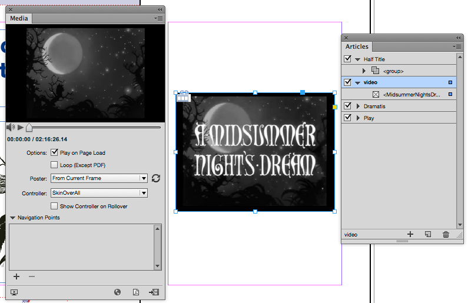
We place video much as we do images. Once placed though, we can then view the settings through the media view panel. We can control the preview image and decide on how to display the controller.


Perhaps a more appropriate use of video within an eBook, is to just show short clips in the appropriate context. The issue with reflowable eBooks, is that we cannot be certain the video will appear right near to the textual context.

## Anchoring and Text Wrap

Unfortunately, InDesign does not provide a way for us to create object styles for media, so we will need to make individual settings for text wrap and anchoring.

## The Result on Export to ePUB (reflowable)

We do not need to apply any specific settings when we export again and the results are initially quite good, but I have found there is a need to edit the CSS to get the video and controller to display full width of the page. InDesign produces a very complex set of `<div>` blocks, and we need to look carefully at these in the HTML markup before experimenting with alternative rules.

## Adding Audio


Audio can be added in much the same way as the video, but once again we need to be aware that probably only want small snippets of audio in context. The audio will initially be placed as a small square, and you will need to stretch this out to fill the width of the page, so that the audio controller is as wide as possible.

There are different behaviours when the audio or video is playing in the book.

When using iBooks on the MAC, the audio and video will continue to play even if the pages are turned. When viewing the eBook on an iOS device like the iPad, the video will stop when the page is turned, but audio will continue to play on page turn.

## Multimedia in the Fixed Layout ePUB

When you create the fixed-layout ePUB from InDesign then the page content will be exactly as you see it in InDesign. With audio you will need to make the audio object fill the frame that you have stretched across the page

We can add audio or video as we can for the reflowable ePUB, but both audio and video will stop playing on page turn on both the MAC and iPad, because each page is a new HTML file.

> **Note:** There are ways to resolve this, and we will see a solution when we reach the section on ambient audio

## Read Aloud

As of this writing, the read aloud feature whereby audio can be synchronised to the text (words or lines highlighted as the audio plays) has some very mixed support. The ePUB3 Media Overlays specification does not get the support it deserves at the moment, so it can be problematic getting this to work properly.

If we use the current method that InDesign provides for exporting the the ePUB(fixed-layout) form, then each word in the HTML is marked-up with a span tag. Now, actually, this is exactly what we need for read-aloud, but then we are committed to highlight every word and also analyse our audio to pick out every word. We will find it very difficult to change the HTML markup to tag each line instead.

The basic principle is that each word spoken and written needs to relate to a time sequence within a longer audio file. A SMIL (Synchronized Multimedia Integration Language) file is constructed so as to mirror the text that is then marked up with the appropriate tags that will tell the text on screen what to highlight as the audio plays.

Building something like this by hand coding would be virtually impossible for the whole of the play, and would also depend on the level of granularity that you want to be highlighted; word, line, sentence, or paragraph etc.

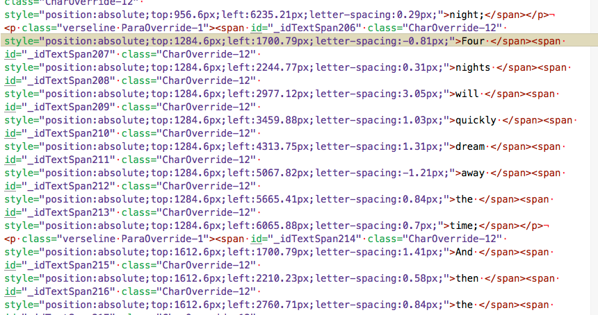

Here we see that the audio section that we will use start ‘Four nights …’ with the span tag `id="_idTextSpan207"`

We now need to construct a SMIL file that uses the following syntax:

```html
<smil xmlns="http://www.w3.org/ns/SMIL" xmlns:epub="http://www.idpf.org/2007/ops" version="3.0">
<body>
<seq id="s000001" epub:textref="dream-05.xhtml">
<par id="par1">
<text src="dream-05.xhtml#_idTextSpan207"/>
<audio src="audio/act1scene1_clip01.mp3" clipBegin="0.000000s" clipEnd="2.214817s" />
</par>
<par id="par2">
<text src="dream-05.xhtml#_idTextSpan208"/>
<audio src="audio/act1scene1_clip01.mp3" clipBegin="2.214817s" clipEnd="4.062584s" />
</par>
<par id="par3">
<text src=“dream-05.xhtml#_idTextSpan209”/>
and so on ….
</seq>
</body>
</smil>
```

You might consider using regular expressions to help with this task. My strategy would be to duplicate the XHTML file (dream-05.xhtml), and then strip out all of the style information. I can then use this base file to reconstruct the `SMIL` tags.

The next challenge is how to identify all of the clip ranges inside the audio file. For this we need the marvellous free audio editor ‘Audacity’.

Audacity can help us build a clip sequence by using a label track:

![[image7.png | Audacity can help locate words spoken within the audio file]]

Then we can export the labels and we get:

```
3.051281 3.379623 Four
3.375440 3.549022 Nights
3.546931 3.820898 will
3.818807 4.172245 quickly
4.170154 4.448303 dream
4.446212 4.596789 away
4.590515 4.747366 the
4.747366 5.238834 time
```
and then we build the SMIL file with some GREP, giving us this:

```html
<smil xmlns="http://www.w3.org/ns/SMIL" xmlns:epub="http://www.idpf.org/2007/ops" version="3.0">
<body>
<seq id="s000001" epub:textref="dream-05.xhtml">
<par id="par1">
<text src="dream-05.xhtml#_idTextSpan207"/>
<audio src="audio/act1scene1_clip01.mp3" clipBegin="0.000000s" clipEnd="2.214817s" />
</par>
<par id="par2">
<text src="dream-05.xhtml#_idTextSpan208"/>
<audio src="audio/act1scene1_clip01.mp3" clipBegin="2.214817s" clipEnd="4.062584s" />
</par>
<par id="par3">
<text src="dream-05.xhtml#_idTextSpan209"/>
<audio src="audio/act1scene1_clip01.mp3" clipBegin="4.062584s" clipEnd="6.006284s" />
</par>
<par id="par4">
<text src="dream-05.xhtml#_idTextSpan210"/>
<audio src="audio/act1scene1_clip01.mp3" clipBegin="6.006284s" clipEnd="7.403579s" />
</par>
</seq>
</body>
</smil>
```

## Additions to the package file (content.opf)

We now need to make changes and additions to the content.opf file. The manifest needs to include the following:

```html
<item id="act1scene1_clip01" href="dream-5.smil" media-type="application/smil+xml"/>
```

and then for each XHTML file where audio is played you should edit to be like this:

```html
<item id="dream-6" href="dream-6.xhtml" media-type="application/xhtml+xml" media-overlay="act1scene1_clip01" />
```

the metadata section should have this:

```html
<meta property="media:duration" refines="#act1scene1_clip01">0:00:53.320</meta>
<meta property="media:duration">0:02:37.970</meta>
```

If you want to explore the read-aloud feature I suggest looking at [Alberto Pettarin’s web site](http://www.albertopettarin.it/blog/2014/08/02/how-to-create-epub-3-read-aloud-ebooks.html)

Alberto Pettarin has created some javascript which can be used to simulate the read-aloud feature and this will even work with a reflowable format of eBook.

## Ambient Sound

It is possible to add audio that plays automatically when a page is opened. The audio will play as long as one XHTML file is open. In other words, you can have a different ambient sound for each chapter. In our example Shakespeare play we can add some ambient audio to the start of the Scene. If you plan to create a reflowable eBook then this sound will play for the whole of this scene by placing the audio once. With a fixed-layout eBook the audio will need to be on each page.

To make the ambient sound user friendly there really needs to be some way to turn this off, if the reader prefers not to hear it.

For the ePUB Fixed layout format, Apple have some proprietary extensions that can handle ambient sound in the ePUB, and if you wish to consider this, then please refer to [Apple’s Asset Guide](https://help.apple.com/itc/booksassetguide/en.lproj/static.html) for eBook production.

[Booktrack](https://www.booktrack.com) have a really effective way to add ambient sound to an eBook, but this requires their own eReader software and the use of their service, however, when you experience their approach to this, you realise, that anything less sophisticated than this, simply won’t do!

## Audio on Click or Touch

When building a fixed-layout ePUB with InDesign, it is also possible to have audio play when an object is touched or clicked.

The audio object must first be placed on a page, and you will need to hide it by covering with the object itself or another opaque box. If the audio object is off the page (on the pasteboard), then it will not export.

Remember that the audio will stop when the user moves to another page.

## Hyperlinked and supplementary Information

We have seen how it is possible to convert footnotes into popup notes, when using InDesign to create reflowable ePUB.

We can also build more advanced popups (or ‘out of flow’ content’) in the reflowable ePUB format, by adding ‘non-linear’ content. This method only has limited support, but is worth considering if your target device is Apple’s iPad.

## Non-Linear Content in a Reflowable ePub

You can create a single HTML5 web page and then create a hyperlink within the text of your eBook. This web page will then display in an overlaid window. When adding this kind of content, there are some steps which must be followed:

When the ePUB3 package is packed you can add the HTML file into the OEBPS folder and then create the hyperlink to that named file.

In the content.opf file add the named file to the list in the manifest section

```html
<item id="lambs" href="lambstales.xhtml" media-type="application/xhtml+xml" />
```

Add the named file into the `<spine>` section but add the attribute ‘linear’

```html
<itemref idref="lambs" linear="no"/>
```

It is also possible to add a PDF into the eBook and have a hyperlink open this file, but once again this must be set to ‘linear-“no”’.

> **Note:** It is not currently possible to get non linear content to work in a fixed-layout ePub.

## Scrolling Text in the Fixed Layout ePUB

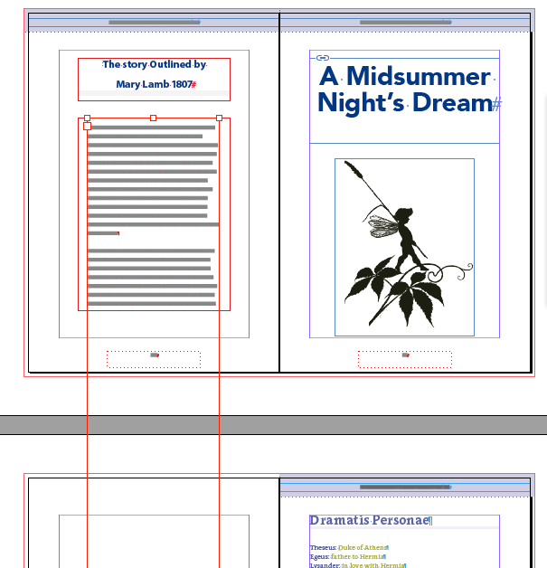

It is not possible to add scrolling text fields in a reflowable ePUB, but with the fixed layout format we can add a text box on a page and include as much scrolling text as you like.

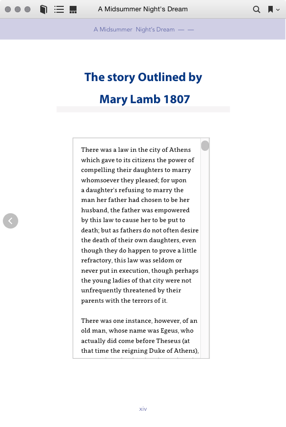

## How to create a vertical scrolling text field

Start a new document in InDesign with a very long vertical page size (maximum height is about 5000pixels). This really just depends on the length of your text!

Paste your long text into a text field on this page.

Make sure there is no overset text. Reduce the vertical size of the text field so that the text just fits. Copy this this text field (not just the contents but the selected object).

In your target InDesign file create an empty text field wider (by about 20mm) than the one you created in the other temporary InDesign document.

Select the text field and ‘Paste Into’ this selected text box. You can select all of this text and style accordingly.

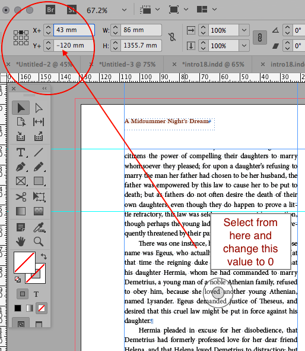

> You will find that InDesign put this text box in the vertical middle and so you won't see the first line of your text or content. To rectify this, you need to use the position box in the InDesign toolbar. Once you see the target circle in the centre of your containing text box, then observe the position number near to the top left. Change this number to `0`. The 2 images here will help you understand this process.

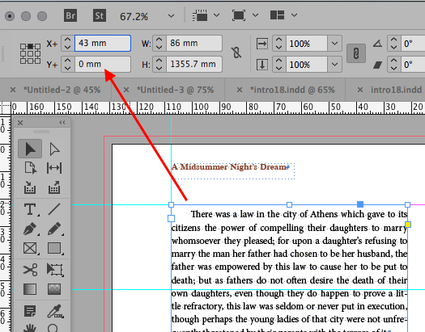

With the parent text box selected, create an Object Style and set the export tagging for HTML and ePUB to a `<div>` with a class of ‘scroller’.

Create a CSS file with the following:

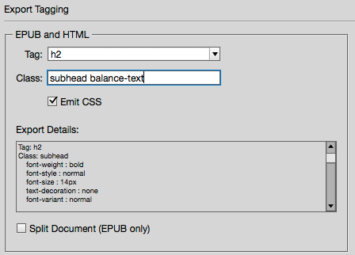

```css
div.scroller {
position: relative;
border:1px solid silver;
}
div.scroller > div {
overflow: auto;
overflow-y:scroll;
overflow: scroll;
overflow-x:hidden;
-webkit-overflow-scrolling:touch;
}
```

Add this CSS file into the CSS panel when you export.

There may be other adjustments that you can make to the CSS, but essentially, this will created a scrolling text field.

You may notice that there is no scroll bar on the iPad until you actually touch the field. You may want to include an instruction above or below the text field to indicate that scroll is available.

As an alternative to using InDesign to create a nested text field, you could also consider leaving a blank page and then adding the text directly into the HTML after unpacking the ePUB package. Just create a web page and then copy the content from within the `<body>` tag and paste into the ePUB page. With additional styling you can then achieve the same as before.

## Adding Popup Information with InDesign for fixed-layout ePUB

Popup notes cannot be created from footnotes in the fixed layout ePub. However, any combination of text and image can be made into a button, and so to make a popup text, you can group a text box with a drawn speech bubble and then make this into a button. You then need a transparent frame laid over the text that you want to be interactive – this then becomes the button that performs the action. You can make the popup speech bubble also have an action to hide itself when clicked.

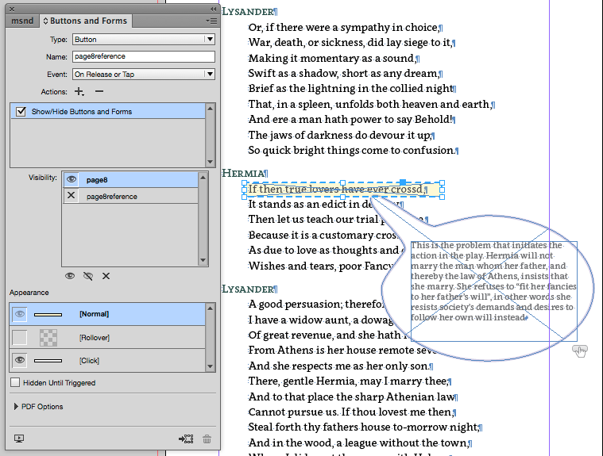

## Animation

InDesign does give you some basic controls over the way objects are dynamically drawn on the screen, and by selecting an object and then the Animation panel (under Window>Interactive), you can invoke an event on page load. Here we see that an image is set to drop down from the top of the page when that page is reached.

> **Note:** Animation is not supported on anchored objects, so you will need to release any previously anchored images.

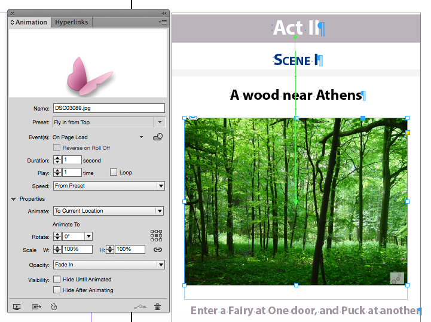

## Creating a Slide Show in InDesign

There is no direct way to create a sequence of images in InDesign (as of this writing), but you can use a ‘multi-state object’ and then create a button that will provide the controls to move through the image sequence.

The images in the sequence need to be the same size and proportion (approximately) and you can add them to InDesign using the following workflow:

Prepare the images so that they are all the same proportion and size (InDesign will crop them to fit if you don't).

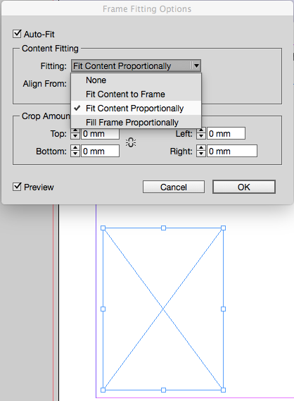

You may need to consider using a full page for this asset, so go ahead and create a new page or find a blank one. If your print book had blank pages then this is a good solution to keeping the same pages but avoiding banks in the eBook.

Create an empty graphics frame and adjust the size in the correct proportion for your image sequence.

You should configure this frame to ‘Fit Content Proportionally’ and turn on ‘Auto Fit’.

Now duplicate this frame for the number of images you want in the sequence. Use the Step and Repeat menu found on the Edit menu. The frames should be offset by a small distance.

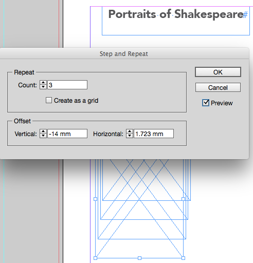

Use the Place command and select all of your images and click each frame in turn to populate the frames with the images. They should automatically resize and crop to fit. When placing images you can select more than one and all we be loaded onto your cursor.

Use the align toolbar to make the frames sit on top of each other. You need to align horizontally first and then vertically.

Use the Object States menu under Window>Interactive and create a new multi-state object while this group is selected. It will automatically add each image into the different states.

Now we need to create buttons to control the sequence as a slide show.

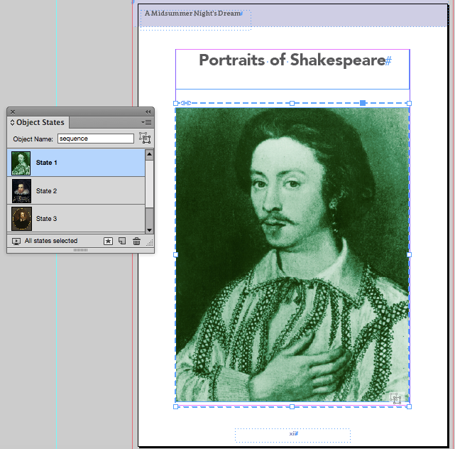

You need to build a graphic that shows a backward or forward triangle.

InDesign can help. The Polygon Frame tool gives you the ability to choose 3 for the number of sides. Turn this around to face to the left and then duplicate and turn to the right. Fill with colour etc.

These triangles then need to be made into buttons (menu>Window>Interactive>Buttons and Forms) and then you need to get the action to change the state of the previously created multi-state object. More than one action can be assigned to a button, so you might consider adding a sound as a second action, to give the user some feedback when they click the button.

## Enough Bells and Whistles?

Since we are creating an alternative publication to the print book, we may want to add some value to the digital version by including those artefacts that certainly are not possible in the pBook!

But let us not get too carried away by all the possibilities. Think carefully about the additional interactivity, multimedia and animation that you add. Ask yourself – does this really enhance the experience for the user or does it over complicate the experience. Are the Bells and Whistles a distraction? Have we become over indulgent and engaged in ‘Feature Creep’?

## ePUB Interactivity Preview

Under the Window>Interactivity menu you will find the EPUB Interactivity Window. With this, you can test your fixed pages (or indeed the whole book) before exporting to the fixed layout ePUB. Not all features can be previewed but certainly the animation, multimedia and interactivity will show as expected.

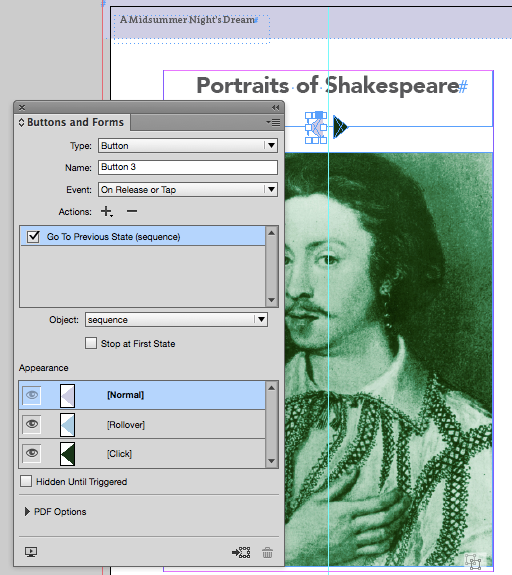

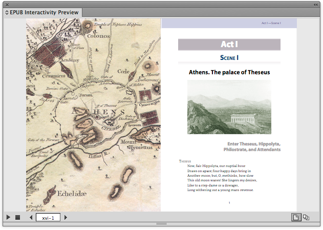

#indesign #html #epubproduction 